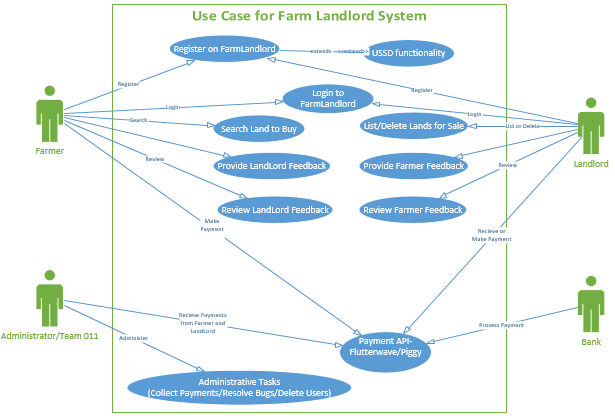

# Farmlord

This application is an innovative solution for connecting subsistent farmers to land owners. It offers the farmers the opportunity to rent the lands or lease at affordable prices. We've built a solution that will help Farmers maximize their productivity and output every harvest by providing the most important resource every Farmer needs - Farmland Real Estate. Landowners that own Farmlands that laying unutilized benefits from this solution simply by enrolling on the platform and making their farmlands available in a virtual market. The whole process entails four simple steps

## See Use Case

Below is a use case flow of the application

## Why

The solution is necessary because many people who wish to farm do not have information about available lands or the prices. Also, the people who have lands but do not know people who need the lands.

## Usage

The solution consist majorly of for steps

### 1. Farmlands

First, you will need to create an account on Farmlord either as Farmer or Landowner. As a Landowner, you can profile your pieces of farmlands on the platform which automatically becomes available on a virtual market. After registering as a Farmer, you may go on the virtual market and view land that interests you.

### 2. Requests

When you find an interesting Farmland that meets your need on the "farmland market", you will simply send a request with just one click! The Landowner will immediately get a "farmland request" notification on their dashboard, prompting them of a Farmer's interest on their listed property on the "farmland market"

### 3. Transact

As soon as a Landowner receives a request to rent or lease their farmland, they will review and accept the request if it meets their preference or decline accordingly. All of these processes should take a few minutes to complete a transaction end to end between a Landowner and the corresponding requesting Farmer.

### 4. Payment

After the Landowner has accepted the land request sent by a Farmer, the Farmer get a notification on their dashboard to make secure payment for a right occupy or lease the farmland as agreed in the terms between Farmer and the Land owner. We've made sure to integrated to a trusted and secure payment service.

## Setup

Install `yarn install`

After clonning the repo `git clone https://github.com/BuildForSDG/team-011-backend.git` , cd team-011-backend to your local machine and moving into the cloned folder, Run `yarn install` to get started by installing dependencies.

`src/server.js` is the entry to the project and source code should go into the `src` folder.

All tests should be written in the `**tests**' folder. There's a sample in there.

This starter uses [Parcel](https://parceljs.org/getting_started.html) as the bundler. It is much simpler that WebPack and the others

### Hints

- Run `yarn install` to get started.
- Install additional dependencies: `yarn add <dependency-name> [-D]`
- Run tests: `yarn test`
- Run tests with test coverage info: `yarn test:cover`
- Check the codebase for proper syntax and formatting compliance: `yarn lint`
- Run your app in local dev mode: `yarn start`. This puts the bundled app in a `dist` folder, set up a local web server at localhost:1234, and continues to watch for your code changes which it syncs with the local server. This means if you loaded the app in a browser, it will auto-refresh as you code along. Feel free to use whatever bundler best meets your needs. Parcel was only added as a sample and for those looking for a simple but effective solution to the hassle of bundlers.

## Authors

The team members of this project are;

- Oluwatoni Ogunfusika - Fullstack <https://github.com/phemm10>
- Fortunatus Ochi - Fullstack <https://github.com/ofuochi>
- Agho Godstime - Fullstack <https://github.com/Gtstride>
- Olanrewaju Ajayi - Fullstack <https://github.com/lurnray>
- Edafeadjeke Emunotor - Fullstack <https://github.com/johnmadakin>

## Contributing

If this project sounds interesting to you and you'd like to contribute, thank you!
First, you can send a mail to buildforsdg@andela.com to indicate your interest, why you'd like to support and what forms of support you can bring to the table, but here are areas we think we'd need the most help in this project :

1. area one (e.g this app is about human trafficking and you need feedback on your road-map and feature list from the private sector / NGOs)
2. area two (e.g you want people to opt-in and try using your staging app at staging.project-name.com and report any bugs via a form)
3. area three (e.g here is the zoom link to our end-of sprint webinar, join and provide feedback as a stakeholder if you can)

## LICENSE

MIT
